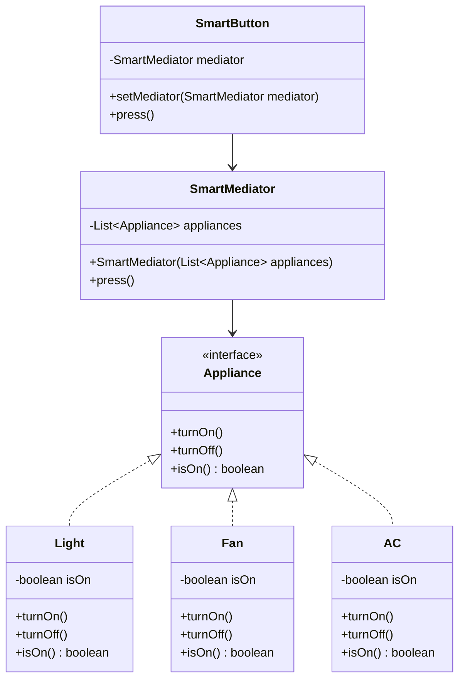

# Mediator Design Pattern Scaleup

This project demonstrates the Mediator Design Pattern by controlling multiple appliances with a single button. The mediator pattern is used to reduce the complexity of communication between multiple objects or classes. This pattern provides a mediator class that normally handles all the communications between different classes and supports easy maintenance of the code by loose coupling.

## Project Overview

In this project, we have implemented a system where multiple appliances (like Fan, Light, and AC) can be controlled using a single button. The `SmartMediator` class acts as the mediator that coordinates the interactions between the `SmartButton` and the appliances.

### Key Components

- **SmartButton**: Represents a UI button component that interacts with the mediator.
- **SmartMediator**: Implements the Mediator interface to coordinate interactions between the SmartButton and multiple appliances.
- **Appliance Interface**: Defines the basic operations for appliances, such as turning on, turning off, and checking if they are on.
- **Light, Fan, AC**: Concrete implementations of the Appliance interface, representing different appliances.

### Class Diagram

### How It Works

1. **Initialization**: Create instances of appliances (Fan, Light, AC) and a SmartButton.
2. **Mediator Setup**: Instantiate a SmartMediator with the list of appliances and set it to the SmartButton.
3. **Button Press**: When the SmartButton is pressed, it notifies the SmartMediator, which toggles the state of each appliance.

### Benefits of the Mediator Pattern

- **Reduced Coupling**: Objects communicate through the mediator rather than directly with each other.
- **Simplified Maintenance**: Changes to one component don't affect others as long as the mediator interface remains stable.
- **Centralized Control**: The mediator provides a central point for controlling complex interactions.
- **Reusability**: Components can be reused in different contexts with different mediators.

This setup allows for centralized control of multiple appliances, demonstrating the power and flexibility of the Mediator Design Pattern.
